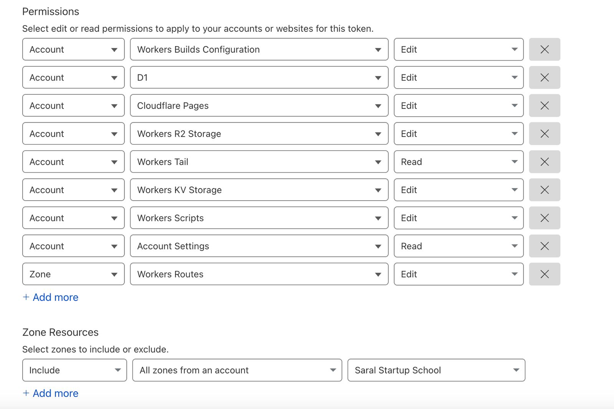

<h1 align="center">Next.js + Cloudflare D1 SQL + Drizzle ORM + Drizzle Kit + Cloudflare Pages starter kit</h1>

# Getting started

## Prerequisites

1. Node.js >=v20.11.0
2. pnpm >=v9.15.1

## Initialise the database(s)

1. Create D1 Database, Cloudflare API Token.

   [Create a production D1 database.](https://developers.cloudflare.com/d1/get-started/#3-create-a-database)
   [Create a cloudflare API Token.](https://developers.cloudflare.com/fundamentals/api/get-started/create-token/)
   
   

2. Install the app's dependencies:

```sh
pnpm install
```

3. Create .env file by copying from .env.example. And update .env file and wrangler.toml file.

4. Generate db migration files (that documents schema changes in an SQL script).

```sh
pnpm db:generate
```

5. Run db migrations (that executes the SQL script to update the database to match the schema).

- dev (local) db: `pnpm db:migrate:dev`
- prod (remote) db: `pnpm db:migrate:prod`

6. View the database using a graphical user interface:

- dev (local) db: `pnpm db:studio:dev`
- prod (remote) db: `pnpm db:studio:prod`

## Run the app

- Run Next.js on dev. Ideal for development since it supports hot-reload/fast refresh.

```sh
pnpm dev
```

⚠️ **Warning**: `next start` will return an error due to how the application is designed to run on
Cloudflare pages.

- Run Cloudflare Pages locally. Ideal to test how the app would work after being deployed.

```sh
pnpm pages:dev
```

⚠️ **Warning #1**: Connecting to the prod remote db on the local code
[is not supported](https://developers.cloudflare.com/d1/build-with-d1/local-development/).

⚠️ **Warning #2**: All pages deployed to Cloudflare Pages run on edge runtime, whereas
[ISR only works on Nodejs runtime](https://developers.cloudflare.com/pages/framework-guides/nextjs/ssr/supported-features/)
(because how Vercel designed their functions); so, some functions like `revalidatePath` will throw
an error when running the app with `pnpm pages:dev`. But, the functions work as expected after
deploying.

## Deploy

- Deploy code to pages:

```sh
pnpm pages:deploy
```
